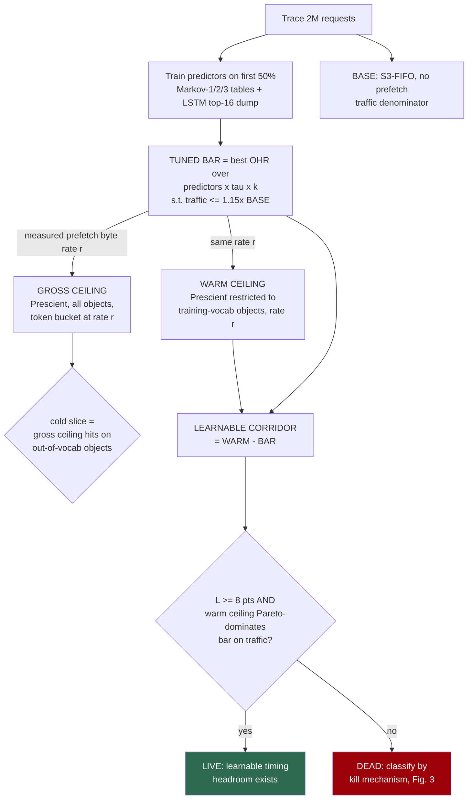
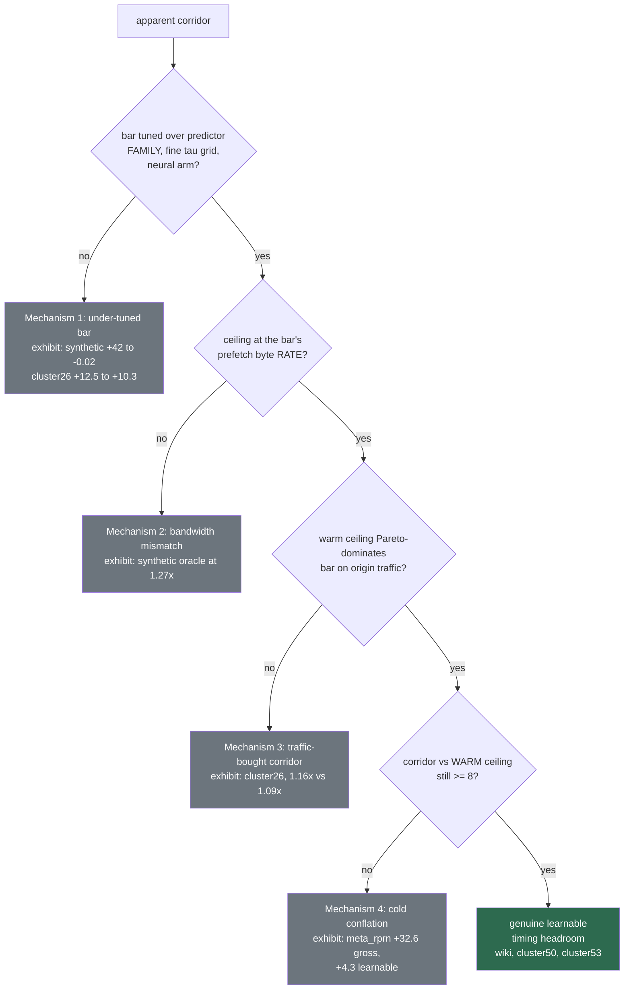

# Phantom Headroom: How Much Prefetch-Timing Gain in Caching Survives an Honest, Bandwidth-Matched Baseline?

*Draft v1 — 2026-07-19. Target: AAAI-27 (abstract 2026-07-21, paper 2026-07-28).*
*Every number in this draft traces to `results.md` and a log in `logs/`. Citations verified against source 2026-07-19; four arXiv-only entries need author lists pulled before camera-ready (marked ⚠).*

---

## Abstract

Learned and oracle-guided prefetchers are credited with large cache hit-rate gains, but these
gains are typically measured against under-tuned baselines, at unmatched prefetch bandwidth, and
against clairvoyant ceilings that conflate hits a deployable policy could reach with hits it never
could. We introduce a pre-registered, bandwidth-matched instrument that isolates the *learnable*
prefetch-timing headroom of a cache workload. The instrument (i) tunes the baseline adversarially
— Markov-1/2/3 and an LSTM, fully swept — under an explicit traffic cap; (ii) grants the
clairvoyant ceiling exactly the baseline's prefetch byte budget; and (iii) splits the resulting
corridor by *reachability*, comparing against a clairvoyant restricted to objects inside the
predictor's training vocabulary, so that compulsory-miss elimination — reachable only by an oracle
— is priced out at equal budget rather than subtracted naively.

Across 12 production traces spanning CDN, key-value, and block storage, gross corridors of +10 to
+33 hit-rate points deflate by 14–87% under this instrument; on the workload classes with the
largest apparent corridors (CDN and block), 51–87% of the gross corridor is phantom. Under a
pre-registered 8-point bar, genuine learnable timing headroom survives on 3 of 12 traces — one CDN
and two key-value — measuring +12.7 to +19.7 points, with paired block-bootstrap 95% confidence
intervals bounded away from the bar. We identify four distinct mechanisms by which apparent
corridors inflate, each caught by a different component of the instrument, and a 2×2 interaction
study (n=6) showing eviction quality and prefetching act as *substitutes*, not complements. We
argue prefetch-timing gains should be reported against a learnable, bandwidth-matched ceiling, and
we release the instrument.

---

## 1. Introduction

A cache prefetcher is judged by the hits it adds. The literature's customary yardsticks for how
many hits *remain addable* are generous ones: the gap to Belady's clairvoyant optimum [1], the gap
to an oracle prefetcher, or the gap over LRU. Each yardstick inflates in its own way. Belady's
bound ignores prefetching entirely, and its prefetch-aware repair (Demand-MIN [3]) shows the
"optimum" itself moves once prefetching enters. Oracle-prefetcher ceilings silently spend
whatever bandwidth they like, while the baselines they are compared to are throttled or simply
under-tuned. And clairvoyant ceilings eliminate *compulsory* misses — first requests to objects
never seen before — which no deployable, history-based policy can prefetch at all.

This paper began as a system-building project whose evaluation kept refusing to cooperate, and we
believe the refusals are the contribution. Our first measurement of "timing headroom" on a
synthetic workload showed a corridor of **+42 points** between a tuned baseline and an oracle. All
of it evaporated under two corrections — tuning the baseline's predictor family instead of only
its thresholds, and granting the oracle exactly the baseline's prefetch byte rate — landing at
**−0.02**. Each subsequent hardening of the protocol converted another celebrated number into an
artifact (§4.4 gives the audit trail, including two of our own retractions). What survived is an
instrument, a taxonomy of the ways prefetch headroom inflates, and a sharply smaller — but
bootstrap-solid — statement of where genuine, learnable timing headroom exists.

**The instrument** (§3) makes three commitments, pre-registered before any real-trace run:

1. **The bar can only be under-tuned, never over-tuned.** The baseline is the *best* configuration
   over a family of decoupled prefetchers — Markov-1/2/3 and an LSTM — swept over confidence
   threshold and prefetch degree under an explicit origin-traffic cap (1.15× the no-prefetch
   arm). Any error in this sweep inflates the corridor we report against ourselves.
2. **Iso-bandwidth or it does not count.** The clairvoyant ceiling receives the tuned bar's
   measured prefetch byte rate through a token bucket, and a Pareto check rejects corridors the
   ceiling buys with extra traffic.
3. **Learnable, not gross.** The primary ceiling is a clairvoyant restricted to objects inside the
   predictor's training vocabulary (the *warm ceiling*). Objects outside it are compulsory-cold:
   no history-based predictor — table, neural, or learned policy — can prefetch an object it has
   never observed. Crucially, the warm ceiling *re-spends* the budget the gross oracle wastes on
   cold objects, so reachable headroom is priced at equal budget rather than subtracted naively
   (§3.3 shows naive subtraction can be off in either direction).

**Findings** (§4). On 12 production traces (Wikipedia CDN, Meta CDN ×2, Twitter KV ×4, MSR block
×3, CloudPhysics block ×2): gross corridors up to +32.7 points deflate by 14–87%. Nine of twelve
traces die — by baseline saturation, degenerate predictability, traffic-bought corridors, or
cold-domination. Three survive with learnable corridors of **+12.7** (Wikipedia), **+17.6** and
**+19.7** (two Twitter clusters), each with a paired block-bootstrap 95% CI whose lower bound
clears the pre-registered 8-point bar. The mechanism separating live from dead is not workload
family but a two-factor property: *exploitable warm reuse* that the *tuned predictor fails to
time* (§5). A 2×2 interaction study across six traces (§6) finds eviction quality and prefetching
substitute for each other everywhere (interaction −1.3 to −7.9 points), an argument against joint
eviction+prefetch co-training and for treating prefetch scheduling as its own layer.

**Contributions.**
- A pre-registered, iso-bandwidth instrument for prefetch-timing headroom whose central object is
  the **learnable corridor**: tuned-bar-to-warm-ceiling at matched budget, with machine-checkable
  invariants (the bar and the warm ceiling each record exactly zero cold prefetch hits).
- A deflationary measurement across 12 production traces: 14–87% of gross corridors are phantom;
  3 of 12 traces retain learnable headroom, bootstrap-confirmed.
- A **taxonomy of four corridor-inflation mechanisms** — under-tuned bars, bandwidth mismatch,
  traffic-bought corridors, cold conflation — each exhibited by a named trace and caught by a
  named component of the instrument.
- An interaction result (n=6): eviction and prefetching are substitutes, not complements.

We do not claim prevalence ("most workloads have timing headroom" is exactly the kind of claim
this instrument exists to prevent). We claim existence with confidence intervals, absence with
mechanisms, and a protocol that lets anyone locate their own workload on the map.

---

## 2. Related Work

**Optimal replacement and its prefetch-aware repairs.** Belady's MIN [1] is optimal for demand
caching without prefetching. Jain and Lin's Demand-MIN [3] showed that under prefetching, MIN no
longer minimizes demand misses, and that a family of prefetch-aware optima trades demand misses
against prefetch traffic — establishing, for hardware caches with uniform lines, that "the
optimum" is bandwidth-relative. Our instrument transports that insight to variable-size object
caches and adds the reachability split: we bound not what an omniscient policy could do, but what
a history-based one could. Cao, Felten, Karlin and Li [2] gave near-optimal integrated
prefetching+caching under clairvoyance, uniform sizes, and a fetch-latency model; none of the
three assumptions hold for CDN/KV objects, which is why we measure ceilings empirically per trace
instead of citing guarantees.

**Learned caching systems.** Learning Relaxed Belady (LRB) [4] imitates a relaxed Belady oracle
for CDN eviction; Cold-RL [7]⚠ learns eviction for NGINX via offline RL; DEAP [8]⚠ learns
admission+eviction+prefetching jointly with supervised sequence models; DeePref [9]⚠ learns
prefetching for video CDNs online; LightCacheRL [10]⚠ unifies prefetch and replacement decisions
in a myopic bandit; Pythia [11] tunes hardware-prefetcher aggressiveness with online RL and
bandwidth feedback; and Yuan et al. [12] share representations between hardware replacement and
prefetching policies. **Baleen** [6] is the nearest neighbor: it learns flash admission *and*
prefetching from Meta traces, gates prefetches by estimated benefit ("ML-When"), and reports
against an OPT-derived episodes bound. Baleen optimizes peak disk-head time on flash under an
admission-centric OPT; it does not measure a timing corridor at matched prefetch bandwidth, nor
split its bound by reachability. None of these works — and to our knowledge no prior work —
constructs a pre-registered, bandwidth-matched, learnability-split headroom measurement for
object caches. That is the gap this paper fills; the systems above are the systems our instrument
is built to evaluate fairly.

**Evaluation rigor as a contribution.** In language-model evaluation, Hochlehnert et al. [13]
showed that claimed reasoning gains shrink dramatically under standardized, variance-aware
protocols. Our paper is the caching analog: not a critique of any single system, but a
demonstration that the field's default yardsticks inflate, plus the corrected yardstick. S3-FIFO
[5] serves as our fixed eviction substrate throughout — a deliberately strong, simple, non-learned
evictor, so that every corridor we measure is attributable to prefetch timing rather than evictor
weakness.

---

## 3. The Instrument

### 3.1 Setup

Deterministic trace replay over 2M-request prefixes of production traces (oracleGeneral format),
byte-capacity cache fixed at 1% of trace footprint, first 5% of requests excluded from all
metrics as warmup, request-weighted object hit ratio (OHR) as the primary metric (byte-weighted
results in the supplement). The evictor is S3-FIFO [5] in every arm, so eviction quality is
controlled. Prefetchers are *decoupled*: they see the request stream, never the future. All
predictors train on the first 50% of the trace (the *training prefix*) and are frozen; the
association tables store full confidence-ranked candidate lists so that sweeping threshold τ and
degree k costs one table build. Prefetched bytes are charged to origin traffic; a
prefetched-then-requested object counts as a hit; a prefetched-then-evicted object counts as
waste. This accounting contract is unit-tested (`p4_prefetch.selftest`).

### 3.2 The four arms



**Fig. 1 — The instrument.** Invariants checked on every run: the bar's cold-prefetch-hit count
and the warm ceiling's cold-prefetch-hit count are both exactly zero (a history-based predictor's
candidates are drawn from its training vocabulary by construction; the warm ceiling is restricted
to it by definition).

- **BASE**: S3-FIFO, no prefetch. Its origin bytes are the traffic denominator for every arm.
- **TUNED BAR**: the best decoupled system we can construct against ourselves — max OHR over
  {Markov-1, Markov-2, Markov-3 (3→2→1 backoff), LSTM} × τ ∈ {0.01…0.5, including 0.06–0.09} ×
  k ∈ {1,2,4}, subject to origin traffic ≤ 1.15× BASE. The cap is 1.15, not 1.10, because our own
  default config lands at 1.10× exactly and a 1.10 cap could reject it on float noise — the cap
  errs *against us* by letting the baseline tune up. The LSTM arm (embedding 128, hidden 256,
  trained on the prefix, per-position top-16 dumped in one causal GPU pass) exists so the bar is
  not merely "best counting table."
- **GROSS CEILING**: Prescient — prefetch the soonest-future uncached objects (k=4) — throttled by
  a token bucket to the *bar's measured prefetch byte rate*. A rate, not a total budget: a total
  is spent greedily at trace start and then prefetching stops, which once made our oracle score
  below a heuristic — the impossible result that exposed the bug. The gross ceiling is reported
  as a diagnostic only.
- **WARM CEILING** (primary): Prescient restricted to training-vocab objects, same token bucket.
  Because the bucket is unchanged, budget the gross oracle spends on unreachable cold objects is
  *re-spent* on warm ones. This is the honest upper bound for any history-based scheduler:
  perfect timing, realistic knowledge, equal budget.

### 3.3 Why the warm ceiling, not subtraction

The tempting shortcut — learnable ≈ gross corridor − cold slice — is wrong in both directions.
It over-penalizes because the oracle's cold prefetches consumed budget a warm-only policy would
redirect (on Wikipedia, 27% of the gross oracle's useful prefetches were cold; redirected, that
budget buys +5.4 points of warm hits). It can also under-penalize via eviction coupling (on
meta_rprn the warm ceiling lands 0.35 points *below* the subtraction estimate). Measured on our
traces, subtraction misstates the learnable corridor by up to 5.4 points — enough to flip a
verdict in either direction. Reachability must be priced *inside* the replay, at the budget, not
adjusted afterward on paper.

We also report, for provenance, that our first cold definition ("object not yet requested at
issue time") was wrong — a frozen predictor legitimately prefetches an object *ahead* of its
first local occurrence if training taught the association. The invariant caught it: the bar
showed 442,188 "cold" hits on Wikipedia where the correct number, under the out-of-vocabulary
definition, is zero. Definitions of learnability need machine-checkable invariants precisely
because they are where motivated reasoning hides.

### 3.4 Escalation protocol and pre-registration

The verdict bar (learnable corridor ≥ 8 OHR points AND Pareto dominance at the warm ceiling) was
fixed before any real-trace run. Baselines escalate in pre-registered stages — coarse Markov-1/2
grid, then fine-τ + Markov-3, then LSTM — and **a LIVE verdict is provisional until it survives
the strongest stage**. Two traces that passed early stages were killed by later ones (§4.4). The
escalation only ever raises the bar, so survival is meaningful and death is final.

---

## 4. Results

### 4.1 Gross corridors and their deaths

**Table 1 — Gate A across 12 traces** (gross corridor = gross ceiling − tuned bar, iso-BW;
strongest-bar values where escalation ran).

| trace | family | base OHR | tuned bar | gross corridor | gross verdict | kill mechanism |
|---|---|---|---|---|---|---|
| wiki_2019t | CDN | 0.152 | 0.5531 @1.09× | +26.49 | live → §4.2 | — |
| meta_rprn | CDN | 0.390 | 0.6738 @1.03× | +32.57 | live → §4.2 | cold-dominated (§4.2) |
| meta_reag | CDN | 0.538 | 0.7547 @1.11× | +24.51 | live → §4.2 | cold-dominated (§4.2) |
| cluster50 | KV | 0.416 | 0.7080 @1.02× | +20.37 | live → §4.2 | — |
| cluster53 | KV | 0.595 | 0.6101 @1.10× (LSTM) | +25.72 | live → §4.2 | — |
| cluster26 | KV | 0.786 | 0.8907 @1.09× | +10.27 | **DEAD** | traffic-bought (Pareto: ceiling 1.16× vs bar 1.09×) |
| cluster10 | KV | 0.500 | 0.7368 @1.00× | −1.18 | DEAD | degenerate predictability (Markov precision 1.000; bar exceeds ceiling) |
| msr_proj_0 | block | 0.552 | 0.7568 @1.13× | +4.16 | DEAD | bar saturation (robust to any cap choice: +3.7 to +5.5) |
| msr_hm_0 | block | 0.657 | 0.8380 @1.13× | +10.08 | live → §4.2 | cold+saturation (§4.2) |
| msr_web_2 | block | 0.010 | 0.8284 @1.00× | −3.81 | DEAD | bar saturation (precision 0.996 at 1.00×) |
| w105 | block | 0.269 | 0.8494 @1.05× | −0.45 | DEAD | bar saturation |
| w87 | block | 0.095 | 0.5383 @1.12× | +32.67 | DEAD* | Pareto fail by 0.01× — boundary case, cited in neither direction |

Three observations. First, the tuned bar is doing real work: on cluster26 the escalation from a
coarse Markov-1/2 grid to fine-τ + Markov-3 raised the bar five points (0.841→0.891) and flipped
a provisional LIVE to DEAD. Second, the LSTM arm took the bar exactly once (cluster53), left it
untouched everywhere else, and never rescued a corridor — the corridors that survive are not
weak-predictor artifacts. Third, liveness is not a family property: MSR block traces produce both
+10.08 and −3.81; Twitter KV produces both +25.72 and −1.18.

### 4.2 The learnable corridor: 14–87% of the gross is phantom

**Table 2 — Warm/cold decomposition on the six gross-live traces** (v3 metric; all runs verify
bar-cold = 0 and warm-cold = 0).

| trace | gross corridor | cold slice (pts) | warm ceiling | **learnable corridor** | phantom share | verdict (≥8 + Pareto) |
|---|---|---|---|---|---|---|
| cluster53 | +24.46 | 4.62 | 0.7940 | **+19.67**† | 20% | **LIVE** |
| cluster50 | +20.37 | 2.69 | 0.8836 | **+17.56** | 14% | **LIVE** |
| wiki_2019t | +26.49 | 19.22 | 0.6803 | **+12.72** | 52% | **LIVE** |
| msr_hm_0 | +10.08 | 5.82 | 0.8869 | +4.89 | 51% | dead |
| meta_rprn | +32.57 | 27.90 | 0.7169 | +4.32 | 87% | dead |
| meta_reag | +24.55 | 20.71 | 0.7906 | +3.63 | 85% | dead |

† cluster53's decomposition and CI use its Markov bar (0.5973 @1.01×); the LSTM bar is 1.28 pts
higher at a larger budget (0.6101 @1.10×). Against the LSTM bar, with the warm ceiling still
handicapped to the *smaller* Markov budget, the corridor is ≥ +18.4 — the verdict is unchanged
under the conservative reading. (meta_reag's decomposition uses a bar 0.04 pts below its
strongest; immaterial and direction-safe.)

```
Wikipedia CDN, OHR — anatomy of a celebrated corridor (all arms at iso-bandwidth):

  base (no prefetch)   0.152  |=====                                  |
  tuned bar            0.553  |=====================                  |
  warm ceiling         0.680  |==========================             |  <- learnable +12.7
  gross ceiling        0.818  |===============================        |  <- phantom   +13.8
                                            ^^^^^^^^^^^^^
                              52% of the gross corridor is compulsory-miss
                              elimination no history-based policy can reach
```

**Fig. 2 — Corridor anatomy, Wikipedia.** The gross corridor (+26.5) that headline evaluations
would report decomposes into +12.7 reachable by a perfectly-timed history-based policy and +13.8
reachable only by clairvoyance.

The deflation is workload-dependent in a mechanistic way: the three CDN/block traces with the
most impressive gross corridors (+24.5 to +32.6) lose 51–87% of them to the cold slice, because
high object churn means the clairvoyant ceiling spends its budget eliminating compulsory misses.
The two low-churn KV traces lose only 14–20%. Wikipedia is the instructive middle case: high
churn (52% phantom) *and* enough exploitable warm reuse that the honest corridor still clears the
bar — but only once the warm ceiling re-spends the cold budget (naive subtraction leaves it at
+7.27, a false kill).

### 4.3 Are the survivors solid? Paired block-bootstrap CIs

Per-request hit indicators for bar and warm ceiling are recorded on the same post-warmup
requests; the corridor is the mean of the paired difference. We resample 1,000 contiguous blocks
(×1,900 requests) with replacement, 10,000 resamples (block, not i.i.d., because hit outcomes are
temporally autocorrelated through cache state).

**Table 3 — Learnable corridor, 95% CIs.** Pre-registered reliability rule: reliably live only if
the CI lower bound ≥ 8.

| trace | learnable | 95% CI | SE | verdict |
|---|---|---|---|---|
| cluster53 | +19.67 | [+19.41, +19.93] | 0.13 | reliably LIVE |
| cluster50 | +17.56 | [+15.78, +19.39] | 0.93 | reliably LIVE |
| wiki_2019t | +12.72 | [+10.93, +14.52] | 0.92 | reliably LIVE |

All three lower bounds clear the bar; Wikipedia — the lowest-margin, most-scrutinized trace —
retains ≈3 points of slack at its 2.5th percentile. (cluster53's SE is ~7× tighter than its
peers; its per-block corridor is unusually stationary. Recorded as observed.)

### 4.4 The instrument versus its authors: an audit trail

A protocol's credibility is what it catches, including from its own authors. In chronological
order, on the record:

1. **The +42 that became −0.02** (synthetic): our first corridor used a default-config baseline
   and an oracle with unmatched bandwidth. Tuning the bar and matching bytes erased it entirely.
2. **The +12.48 that became DEAD** (cluster26): a coarse τ grid hid cap-edge configurations; the
   fine grid plus Markov-3 raised the bar five points, and the Pareto check showed even
   clairvoyance buys the residual corridor with 7% extra traffic.
3. **A retracted cold definition**: our first "cold" (never-yet-requested at issue) violated its
   own invariant — the *bar* scored 442k cold hits where the correct count is zero. The
   out-of-vocabulary definition restored the invariant and the retraction is recorded.
4. **A false kill reversed for a principled reason** (Wikipedia): under naive subtraction wiki
   fell to +7.27, below the bar. The warm ceiling — adopted because subtraction is *wrong*, not
   because we disliked the verdict; predicted even-odds beforehand — measures +12.72. The 8-point
   bar never moved in either direction.



**Fig. 3 — Four corridor-inflation mechanisms**, each with the component that catches it and the
trace that exhibits it.

---

## 5. Mechanism: what separates live from dead

The dead traces are not "hard" and the live ones "easy" — the separation is a two-factor
property visible in Table 2's bar-vs-warm-ceiling gaps:

- **Dead: the tuned bar already saturates the warm ceiling.** meta_reag (bar 0.754 vs warm 0.791),
  msr_hm_0 (0.838 vs 0.887), meta_rprn (0.674 vs 0.717): whatever warm reuse exists, a
  well-swept counting table already times it. What remains of the gross corridor is compulsory
  cold — unreachable by construction. Nothing here for a smarter scheduler to win.
- **Live: exploitable warm reuse the tuned predictor fails to time.** Wikipedia's bar (0.553)
  sits 12.7 points under its warm ceiling (0.680): the reuse is in-vocabulary and
  perfectly-timeable at the same budget, but fixed-threshold association prefetching cannot
  schedule it. Same shape on cluster50 (0.708 vs 0.884) and cluster53.

So the quantity a *learned prefetch scheduler* should target is precisely the learnable corridor:
it exists where reuse is reachable-in-principle and mistimed-in-practice. Conversely, the
instrument tells a practitioner when *not* to build one: on saturated traces the honest ceiling
concedes at most ~4–5 points to perfect timing — under measurement error and deployment risk,
that is a recommendation to keep the counting table.

---

## 6. Eviction and prefetching are substitutes (n = 6)

If better eviction and better prefetching fixed *different* misses, a joint policy could exploit
the coupling. We measure the interaction directly: a 2×2 of {S3-FIFO, Belady} × {no prefetch,
Prescient@matched-BW} per trace; the interaction is (eviction gain under oracle prefetch) −
(eviction gain without prefetch).

**Table 4 — Interaction, six traces:** msr_proj_0 −1.34, msr_hm_0 −2.31, wiki −3.88,
cluster53 −6.66, cluster50 −7.83, meta_rprn −7.94. **All negative: substitutes.** Better
prefetching shrinks what better eviction can add on every trace measured — they compete for the
same misses. (On variable-size CDN/KV objects Belady is a strong heuristic, not a proven optimum
[3]; only the uniform-block MSR rows carry "optimal" in the strict sense.)

Two implications. For system design: joint eviction+prefetch co-training chases a coupling that
is negative everywhere we measured — the decoupled architecture (strong fixed evictor + separate
prefetch scheduling) is not a simplification but the indicated design. For our own history: this
result killed the joint-RL thesis this project began with, and we report it as a finding rather
than repurposing it as motivation.

---

## 7. Scope and threats to validity

- **"Learnable" is defined against frozen, history-based prediction** (training-prefix
  vocabulary). An online-updating predictor could reach an object from its second occurrence
  onward, narrowing the cold slice; content-aware prediction (URLs, embeddings) could reach some
  of it too. Both would *raise* live corridors and could revive dead traces — our verdicts are
  conservative in that direction. The frozen protocol is stated, uniform, and invariant-checked.
- **One cache size (1% of footprint), 2M-request prefixes, request-weighted OHR.** Byte-weighted
  columns and the Meta traces' below-1.0× ceiling traffic (perfect timing eliminates
  evict-refetch churn) are in the supplement; cache-size sweeps are future work.
- **Twitter traces are 1-in-10 samples** (as published). Sampling stretches inter-reference gaps
  and destroys exact adjacency; it handicaps the LSTM's next-token objective more than the
  window-based Markov tables — one reason the LSTM rarely takes the bar. Corridors on sampled
  traces are internally consistent (all arms replay the same sampled trace) but absolute OHRs are
  not comparable to unsampled deployments.
- **n = 3 live.** We claim existence (with CIs) and mechanism, not prevalence. The instrument is
  the artifact that lets anyone extend the map.
- **CIs cover within-trace sampling variance only** — not trace choice, split choice, or sweep
  granularity. The escalation protocol addresses the last of these structurally: every error in
  the bar inflates corridors, so surviving corridors are lower bounds on scrutiny, not upper.

---

## 8. Conclusion

Measured honestly — against a family-tuned baseline, at matched bandwidth, above a ceiling
restricted to reachable objects — most celebrated prefetch-timing headroom in caching is phantom:
14–87% of gross corridors evaporate across 12 production traces, and the biggest corridors lose
the most. What remains is neither nothing nor everything: +12.7 to +19.7 points of genuine,
bootstrap-solid, learnable timing headroom on 3 of 12 traces, concentrated where in-vocabulary
reuse exists but fixed-threshold prediction mistimes it. The instrument that produced these
numbers pre-registers its bar, escalates its own baselines, checks its invariants mechanically,
and caught its authors four times before it caught anyone else. We release it in that spirit: the
point is not that prefetch timing is a mirage — on the right workloads it demonstrably is not —
but that the field's yardsticks cannot currently tell the difference, and now there is one that
can.

---

## References

*(✓ = verified against source 2026-07-19; ⚠ = arXiv-verified, pull full author list before camera-ready.)*

1. ✓ L. A. Belady. *A study of replacement algorithms for a virtual-storage computer.* IBM Systems
   Journal 5(2), 1966.
2. ✓ P. Cao, E. W. Felten, A. R. Karlin, K. Li. *A study of integrated prefetching and caching
   strategies.* SIGMETRICS 1995.
3. ✓ A. Jain, C. Lin. *Rethinking Belady's algorithm to accommodate prefetching* (Demand-MIN).
   ISCA 2018.
4. ✓ Z. Song, D. S. Berger, K. Li, W. Lloyd. *Learning relaxed Belady for content distribution
   network caching* (LRB). NSDI 2020.
5. ✓ J. Yang, Y. Zhang, Z. Qiu, Y. Yue, K. V. Rashmi. *FIFO queues are all you need for cache
   eviction* (S3-FIFO). SOSP 2023.
6. ✓ D. L.-K. Wong, H. Wu, C. Molder, S. Gunasekar, J. Lu, S. Khandkar, A. Sharma, D. S. Berger,
   N. Beckmann, G. R. Ganger. *Baleen: ML admission & prefetching for flash caches.* FAST 2024.
7. ⚠ *Cold-RL: Learning cache eviction with offline reinforcement learning for NGINX.*
   arXiv:2508.12485, 2025.
8. ⚠ *DEAP Cache: Deep eviction admission and prefetching for cache.* arXiv:2009.09206, 2020.
9. ⚠ *DeePref: Deep reinforcement learning for video prefetching in content delivery networks.*
   arXiv:2310.07881, 2023.
10. ⚠ *LightCacheRL: A lightweight reinforcement learning framework for unified cache management.*
    Springer, 2025 (doi:10.1007/978-3-032-10459-5_11).
11. ✓ R. Bera et al. *Pythia: A customizable hardware prefetching framework using online
    reinforcement learning.* MICRO 2021 (arXiv:2109.12021).
12. ✓ S. Yuan, D. Saxena, J. Chen, N. Sharma, A. Akella. *A joint learning approach to hardware
    caching and prefetching.* ML for Systems Workshop @ NeurIPS 2025 (arXiv:2510.10862).
13. ✓ A. Hochlehnert, H. Bhatnagar, V. Udandarao, S. Albanie, A. Prabhu, M. Bethge. *A sober look
    at progress in language model reasoning: pitfalls and paths to reproducibility.*
    arXiv:2504.07086, 2025.

---

## Appendix pointers (supplement)

- Full sweep tables for all 12 traces: `logs/breadth_summary.txt`, `logs/strongbar_*.log`,
  `logs/day1*_nohup.log`, `logs/warm_*.log`, `logs/gate_b_live.log`.
- Byte-hit-rate columns; Meta ceiling traffic < 1.0× analysis (evict-refetch elimination).
- w87 boundary case (Pareto fail by 0.01×) byte-weighted follow-up.
- Retracted cold-split v1 numbers, kept for provenance (`results.md`).
- Accounting-contract unit tests; LSTM training diagnostics (per-trace eval top-1 accuracy).
